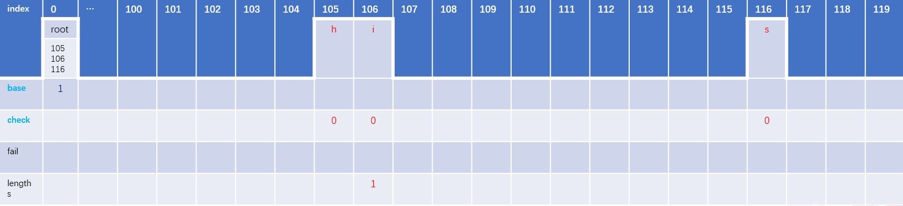
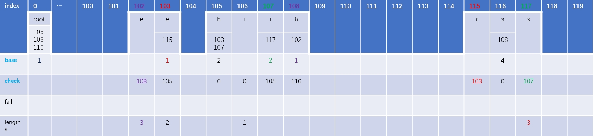
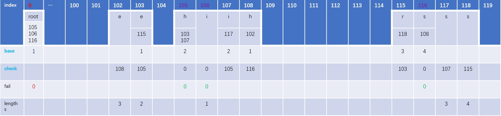
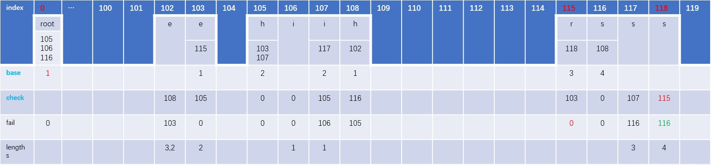
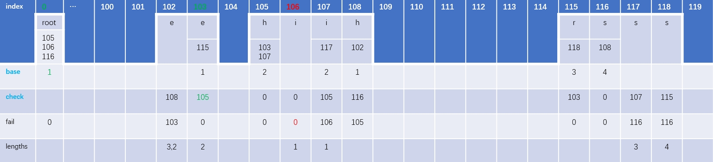
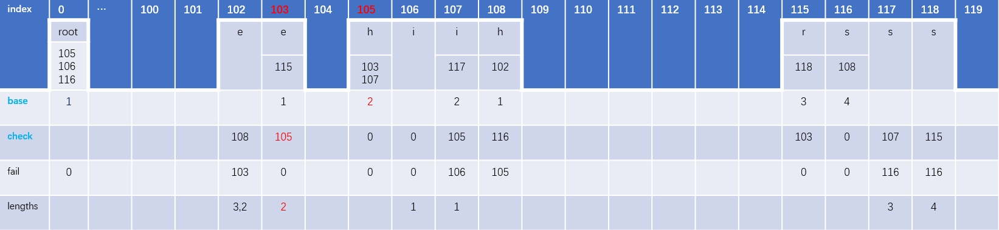
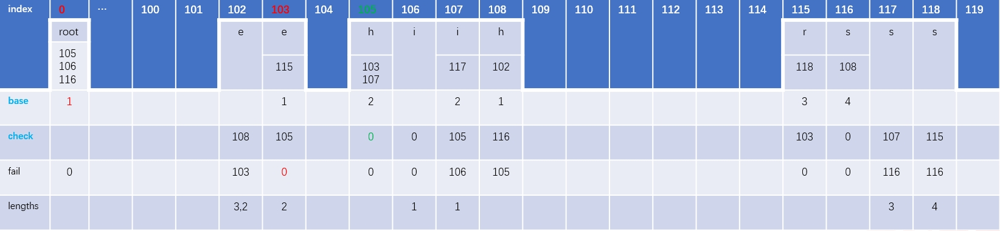
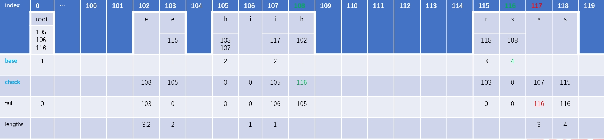
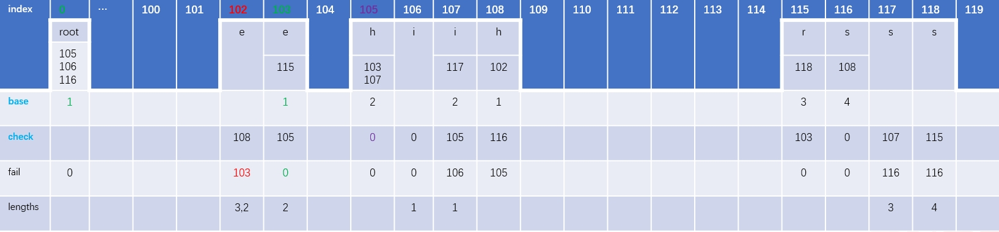

# 双数字典树(double array trie)

#### 引言

多模式匹配一种常见的算法是构造AC自动机，即使用字典树(trie)结合fail指针来做多个关键字查找，双数组字典树是多模式匹配的一种实现方式，利用base和check数组做状态转移，相当于模拟实现了trie，跟AC自动机对比，双数组字典树理论上查找速度比基于哈希映射的trie快。


## 双数组字典树(double array trie)构建base和check数组

##### 一、构建流程前言

- 构建base和check的一个小技巧：对给定的多个字符串从小到大的排序，好处是可以通过下标找到孩子节点，不需要使用论文中的tail数组做辅助。

- 本次演示增加一个lengths数组记录结束字符的时候字符串的长度，不使用论文中用负数表示字符串是否结束。

##### 一、构建base和check的规则：

理解下面2个公式的含义很重要，构造base和check数组的时候不断的会使用到这2个规则。

- ```
  base[s] + c = t
  s：理解为父节点的坐标位置(index)
  base[s]：表示位置s对应父节点存储的base值
  c：对应孩子节点的ascii码
  t：计算出来孩子节点应该放入的位置(index)，通过base[t]或者check[t]检查是否可以放入这个位置。
  如果check[t]的结果为0，表示寻找到的孩子节点的位置(index)未被占用，此孩子节点c可以暂时放在t这个位置。
  如果check[t]的结果不为0，表示根据c找的位置被其他节点占用，需要增加父节点base[s]的值重新寻找一个t为的值。
  ```
  
- ``` 
  check[t] = s
  t：孩子节点的index
  s：父节点的index
  建立孩子节点和父节点对应关系，同时check[t]!=0也表示该位置t已经被占用。

##### 三、构建流程

问题：给定多个字符串：i，he，his，she，hers，构建这些字符串的双数组字典树的base和check数组。


注意：这是演示index是从0开始的，主要是遵从论文的使用方法，演示的使用check[index]查看这个位置是否被占用；实际写代码的时候，确定check的值后，base的值可以先用父亲节点的base值占位，这样可以用base[index]代替check[index]做检测。

为了演示的构造base和check清晰易懂，我们用5个数组来辅助处理

```
index:数组下标
base:可以理解父节点的值是多少的时候，找到的孩子节点的位置是空
check:主要建立孩子节点和父亲节点的对应关系，同时也可以用来表示位置是否被占用
fail:多模式匹配的跳转
lengths:如果这个位置是结束字符，记录结束字符的长度，可以记录多个结束字符长度
```


1、初始设置root位于index[0]处，并且初始化base[0]=1。


2、第1层：root下有节点h、i、s，对应的ascii码值是h:104 i:105 s:115


根据构造的公式：base[s] + c = t，做如下操作：

父亲节点root下有孩子节点h、i、s，父亲节点root当前位于index[0]。

- 节点h：base[s] + c = base[0]+'h' = base[0]+104 =  t(1) 
- 节点i： base[s] + c = base[0]+'i'   = base[0]+105 =  t(2)  
- 节点s：base[s] + c = base[0]+'s'  = base[0]+115 =  t(3) 

初始化base[0]=1，则t(1)=105，t(2)=106，t(3)=116，同时查看表格中check[105]、check[106]、check[116]的位置都为空，说明当base[0]=1的时候，root节点下的孩子节点h、i、j找到位置105、106、116可以存放。base[0]可以等于1。

同时这个root节点下的i是结束字符，需要记录lengths[106]=1。

根据构造的公式：check[t] = s，做如下操作：

- 初始值base[0]=1，root节点下的找到孩子节点h、i、s分别对应的坐标是105、106、116。

  需要建立孩子节点(h、i、s)节点的index和父亲节点(root)的index的对应关系，即check[105]=0、check[106]=0、check[116]=0



3、第2层节点：e、i、h。对应的ascii码值是e:101 i:105 h:104。


根据构造的公式：base[s] + c = t，做如下操作：

父亲节点h下面有孩子节点e和i，父亲节点h的已经找到的位置坐标是index[105]

- 节点e：base[s]+c = base[105]+'e'  = base[105]+101 = t(1)
- 节点i:    base[s]+c = base[105]+'i'   = base[105]+105 = t(2) 

我们需要根据base[105]的值，找到t(1)和t(2)都为空的位置(index)。

假如base[105]=1，则t(1)=102，t(2)=106。check[102]位置为空，可以使用，但是check[106]位置不为空，已经被第一层节点i占用，base[105]=1不成立。

假如base[105]=2，则t(1)=103，t(2)=107。查看表格check[103]和check[107]位置都为空，所以父节点base[105]=2的时候，孩子节点都可以找到空位置。

再看另外一个父亲节点s下面有孩子节点h，父亲节点s的已经找到的位置坐标是index[116]。

- 节点h：base[s]+c = base[116]+'h' = base[116]+104 = t(3)

假如base[116]=1，t=105，check[105]已经被占用；假如base[116]=2，t=106，check[106]也已经被占用；假如base[116]=3，t=107，check[107]也被同层节点i占用；假如base[116]=4，t=108，check[108]位置为空，可以使用，所以base[116]=4

根据构造的公式：check[t] = s，做如下操作：

- base[105]=2，父亲节点h下找到孩子节点e、i的位置是103和107，建立孩子节点(e、i)和父亲节点(h)的对应关系，即check[103]=105，check[107]=105
- base[116]=4，父亲节点s下找到孩子节点h的位置是108，建立孩子节点(h)和父亲节点(s)的对应关系，即check[108]=116

同时节点e是结束字符，需要记录lengths[103]=2


4、第3层节点：r、s、e，对应的ascii码的值是r:114 s:115 e:101，其中e下有孩子节点r，i下有孩子节点s，h下有孩子节点e


父亲节点e下面有孩子节点r，父亲节点i下面有孩子节点s，父亲节点h下面有e

根据构造的公式：base[s] + c = t，做如下操作：

- 节点r：base[s]+c = base[103]+'r' = base[103]+114 = t

如果父亲节点e的base[103]=1，则t=115，check[115]目前位置为空，所以孩子节点r可以放在index[115]位置，最终**base[103]=1**

- 节点s：base[s]+c = base[107]+'s' = base[107]+115 = t

如果父亲节点i的base[107]=1，则t=116，check[116]目前位置不为空，所以孩子节点s不可以放在index[116]位置；

如果父亲节点i的base[107]=2，则t=117，check[117]目前位置为空，所以孩子节点s可以放在index[117]位置，最终**base[107]=2**。

- 节点e：base[s]+c = base[108]+'e' = base[108]+101 = t

如果父亲节点h的base[108]=1，则t=102，check[102]目前位置为空，所以孩子节点e可以放在index[102]位置，最终**base[108]=1**。

根据构造的公式check[t] = s：，做如下操作：

- base[103]=1，父亲节点e找到孩子节点r可以放入的空闲位置是index[115]，建立孩子节点r和父亲节点e的对应关系，即**check[115]=103**
- base[107]=2，父亲节点i找到孩子节点s可以放入的空闲位置是index[117]，建立孩子节点s和父亲节点i的对应关系，即**check[117]=107**
- base[108]=1，父亲节点h找到孩子节点e可以放入的空闲位置是index[102]，建立孩子节点e和父亲节点h的对应关系，即**check[102]=108**



5、第4层节点：s，对应的ascii码值是s:115，其中r下有孩子节点s


父亲节点r下面有孩子节点s

根据构造的公式：base[s] + c = t，做如下操作：

- 孩子节点s：base[s]+c = base[115]+'s'=base[115]+115=t

如果base[115]=1，则t=116，check[116]目前位置不为空，所以孩子节点s不可以放在index[116]位置。

如果base[115]=2，则t=117，check[117]目前位置不为空，所以孩子节点s不可以放在index[117]位置。

如果base[115]=3，则t=118，check[118]目前位置不为空，所以孩子节点s可以放在index[118]位置，最终**base[115]=3**

根据构造的公式：check[t] = s，做如下操作：

- base[115]=3，父亲节点r找打还在节点s的空闲位置是index[118]，建立孩子节点s和父亲节点r的对应关系，即**check[118]=103**


## 双数组字典树(double array trie)构建fail数组

##### 一、构建fail数组规则：

- 按层次遍历(DFS)多个字符串。

- root节点和root的孩子节点的fail指针都指向root，也就是fail数组都填写root的index。
- 节点(假如a)，先找到父节点b，再找父节点b的fail指针指向的节点c，查看节点c是否有与节点a相等的节点(假如d)，如果找到，a的fail数组填写d节点的index，否则，以节点c为起点递归查找，重复步骤2操作。
  递归的出口：如果节点c的孩子节点中(包含节点d的多个节点)没有等于节点a的元素，并且节点c是root节点，则查找结束，a的fail指针指向root，也就是a的fail数组填写root的index值。
- 构造fail数组的时候，如果节点a的fail指针指向节点b，并且节点b的lengths对应的长度有值m，需要把长度m添加到节点a的lengths中。

##### 二、fail数组的构建流程

###### 1、构建root节点和第一层节点(root孩子节点h、i、s)的fail数组


root节点的fail指针指向root节点，即**fail[0]=0**。

第一层节点的fail指针指向root节点，即**fail[105]=0**，**fail[106]=0**，**fail[116]=0**。



###### 2、第二层节点e、i、h。 


- 节点e：位置是index[103]，根据check[103]=105可知，index[103]的父亲节点是index[105]，index[105]的fail[105]=0，即index[105]指向root，查看root节点下没有与index[103]相等的孩子节点，没有找到index[103]的fail指针可以指向的元素，但是此时已经查找到root节点，index[103]的fail指针指向root节点，即**fail[103]=0**。
- 节点i： 位置是index[107]，根据check[107]=105可知，index[107]的父亲节点是index[105]，index[105]的fail[105]=0，即index[105]指向root节点，查看root节点下有与index[107]相等的孩子节点index[106]，将index[107]的fail指针指向index[106]，即**fail[107]=106**。同时，查看lengths[106]=1，说明index[106]是一个结束字符，需要lengths[106]拷贝到lengths[107]中，即**lengths[107]=1**。
- 节点h：位置是index[108]，根据check[108]=116可知，index[108]的父亲节点是index[116]，index[116]的fail[116]=0，即index[116]指向root节点，查看你root节点下有与index[108]相等的孩子节点index[105]，index[108]的fail指针指向index[105]，即**fail[108]=105**


###### 3、第三层节点有r、s、e。


- 节点r：位置是index[115]，根据check[115]=103可知，index[115]的父亲节点是index[103，index[103]的fail指针指向root，并且root下没有与index[115]相等的元素，index[115]的fail指针指向root节点，即：**fail[115]=0**。
- 节点s：位置是index[117]，根据check[117]=107可知，index[117]的父亲节点是index[107]，index[107]的fail[107]=106，查询index[106]下没有与index[117]相等的的孩子节点，继续寻找index[106]的父亲节，根据check[106]=0可以，index[106]的父亲节点是root，查询root下有与index[117]相等的孩子节点index[116]，将节点index[117]的fail指针指向index[116]，即**fail[117]=116**。
- 节点e：位置是index[102]，根据check[102]=108可知，index[102]的父亲节点是index[108]，index[108]的fail[108]=105，查询index[105]下有个孩子节点index[103]与index[102]节点相等，将index[102]的fail指针指向节点index[103]，即**fail[102]=103**。同时将lengths[103]的长度2添加到lengths[102]对应的lengths数组中，添加后**lengths[102]=3,2**


###### 4、第四层节点有s。


- 节点s：位置是index[118]，根据check[118]=115可知，父亲节点是index[115]，index[115]的fail[115]=0，即index[115]节点的fail指针指向root，查询root下有孩子节点index[116]与节点index[118]相同，将index[118]的fail指针指向index[116]，即**fail[118]=116**。




## 双数组字典树(double array trie)查找

##### 一、查找规则：

假如被查找字符是F，当前节点是parent，parent的孩子节点是child，当前节点(parent)的坐标位置是parentIndex。

- 查表查看当前节点(parent)下面的孩子节点(child)是否有与被查找字符F相等的孩子节点：
  - 如果有child = F，找到有与字符F相等的孩子节点，则返回孩子节点(child)的下标index给parentIndex，本次查找结束。
  - 如果child != F，则查看当前节点(parent)是否是root节点：
    - 当前节点(parent)是root节点，则返回root下标index给parentIndex，本次查找结束。
    - 当前节点(parent)不是root节点，查表取出fail[parentIndex]的下标index给parentIndex，也就是找到当前的节点fail指针指向的节点PreNode，将PreNode节点设置为当前节点，继续最开始查找流程。

再来看看下面2个公式，下面会不停的用到这2个公式的转换：

- ```base[s] + c = t```
- ```check[t] = s```

##### 二、查找流程

接下来演示一遍查找流程。

给定一段字符串"ifindhehishehersall"，查找出所有这些关键字[i，he，his，she，hers]在给定字符串中出现的位置信息。


首先定义一个查找变量：parentIndex。

初次查找是从root节点开始查找，初始化parentIndex为root的index，即**parentIndex=0**。

###### 1、查找第1个字符i，ascii码是105

- 当前parentIndex=0。

- 查表显示base[0]不为空，说明index[0]节点下有孩子节点。

  查看index[0]节点下如果有字符i的状态转移公式，查表：

  - ``` base[s]+c = base[0]+'i' = 1+105 = 106```
  - ```check[106] = 0``` 

  根据上面公式可知，index[0]节点下找到与字符i相等的孩子节点index[106]，返回孩子节点的下标106给parentIndex，即**parentIndex=106**。

- 查表显示lengths[106]=1，说明当前位置有1个结束字符，这个字符串长度是1，起始坐标是(0, 0)，匹配到的关键字是：i。

- 继续下一个字符查找。


###### 2、查找第2个字符f，ascii码是102

- 当前parentIndex=106。

- 查表显示base[106]值为空，说明index[106]节点下的没有孩子节点，index[106]也不是root节点，查表显示fail[106]=0，将0赋值给parentIndex，即**parentIndex=0**。

- 查表显示base[0]不为空，表明index[0]节点下有孩子节点。

  查看index[0]节点下如果有字符f的状态转移公式，查表：

  - ```base[s]+c = base[0]+'f' = 1+102 = 103```
  - ```check[103] = 105```

  根据上面转移公式可知check[103] != 0 ，说明父亲节点index[0]下没有与字符f相等的孩子节点，返回index[0]坐标给parentIndex，即**parentIndex=0**

- 继续下一个字符查找。



###### 3、查找第3个字符i，ascii码是105

- 当前parentIndex=0。

- 查表显示base[0]不为空，说明有index[0]节点下有孩子节点。

  查看index[0]节点下如果有字符i的状态转移公式，查表：

  - ```base[s]+c = base[0]+'i' = 1+105 = 106```
  - ```check[106] = 0```

  根据上面转移公式可知check[106]=0，说明父亲节点index[0]下有与字符i相等的孩子节点index[106]，返回查找到的孩子节点坐标index给parentIndex，也就是**parentIndex=106**

- 查表显示lengths[106]=1，说明当前位置有一个结束字符，这个字符串长度是1，起始下标是(2, 2)，匹配到的关键字是：i。

- 继续下一个字符查找。


###### 4、查找第4个字符n，ascii码是110

- 当前parentIndex=106。

- 查表显示base[106]是空，说明index[106]节点下没有孩子节点，同时index[106]节点也不是root节点，查表可知fail[106]=0，将0赋值给parentIndex，即**parentIndex=0**。

- 查表可知base[0]不为空，说明index[0]节点下有孩子节点。

  查看index[0]节点下如果有字符n的状态转移公式，查表：

  - ```base[s]+c = base[0]+'n' = 1+110 = 111```
  - ```check[111] = null(空值)```

  根据上面公式可知，index[0]节点下没有与字符n相等的孩子节点，当前节点是root节点，返回root节点的index给parentIndex，即**parentIndex=0**

- 继续下一个字符查找。


###### 5、查找第5个字符d，ascii码是100

- 当前parentIndex=0。

- 查表显示base[0]不为空，说明index[0]节点下有孩子节点。

  查看index[0]节点下如果有字符d的状态转移公式，查表：

  - ```base[s]+c = base[0]+'d' = 1+100 = 101```
  - ```check[101] = null(空值)```

  根据上面的公式可以知道，index[0]节点下没有与字符d相等的孩子节点，index[0]节点是root节点，返回root的index给parentIndex，即**parentIndex=0**

- 继续下一个字符查找。


###### 6、查找第6个字符h，ascii码是104

- 当前parentIndex=0。

- 查表显示base[0]不为空，说明index[0]节点下有孩子节点。

  查看index[0]节点下如果有字符h的状态转移公式，查表：

  - ```base[s]+c = base[0]+'h' = 1+104 = 105```
  - ```check[105] = 0```

  根据上面公式可知，index[0]节点下找到与字符h相等孩子节点index[105]，返回105给parentIndex，即**parentIndex=105**。

- 查表显示lengths[105]为空，说明当前位置没有结束字符。

- 继续下一个字符查找。


###### 7、查找第7个字符e，ascii码是101

- 当前parentIndex=105。

- 查表显示base[105]不为空，说明index[105]节点下有孩子节点。

  查看index[105]节点下如果有字符e的状态转移公式，查表：

  - ```base[s]+c = base[105]+'e' = 2+101 = 103```
  - ```check[103] = 105```

  根据上面公式可知，index[105]节点下有与字符e相等的孩子节点index[103]，返回103给parentIndex，即**parentIndex=103**。

- 查表显示lengths[103]=2，说明当前位置有结束字符，这个字符串长度是2，起始坐标(5,6)，匹配到的关键字是：he。

- 继续下一个字符查找。



###### 8、查找第8个字符h，ascii码是104

- 当前parentIndex=103。

- 查表显示base[103]不为空，说明index[103]节点下有孩子节点。

  查看index[103]节点下如果有字符h的状态转移公式，查表：

  - ```base[s]+c = base[103]+'h' = 1+104 = 105```
  - ```check[105] = 0```

  根据上面公式可知：check[105] != 103，说明index[103]节点下没有与字符h相等的孩子节点，同时index[103]节点也不是root节点，查表可知fail[103]=0，把0赋值给parentIndex，也就是**parentIndex=0**。

- 查表显示base[0]不为空，说明index[0]节点下有孩子节点。

  查看index[0]节点下如果有字符h的状态转移公式，查表：

  - ```base[s]+c = base[0]+'h' = 1+104 = 105```
  - ```check[105] = 0```

  根据上面的公式可知，index[0]节点找到了与h相等的孩子节点index[105]，返回105给parentIndex，即**parentIndex=105**。

- 查表显示lengths[105]为空，说明当前位置没有结束字符。

- 继续下一个字符查找。



###### 9、查找第9个字符i，ascii码是105

- 当前parentIndex =105。

- 查表显示base[105]不为空，说明index[105]下有孩子节点。

  查看index[105]节点下如果有字符i的状态转移公式，查表：

  - ```base[s]+c = base[105]+'i' = 2+105 = 107```
  - ```check[107] = 105```

  根据上面的公式可知，index[105]下找到与字符i相等的孩子节点index[107]，返回孩子节点的index给parentIndex ，即**parentIndex =107**。

- 查表显示lengths[107]=1，说明当前位置有1个结束字符，这个字符长度为1，起始坐标(8,8)，匹配到的关键字是：i。

- 继续下一个字符查找。


###### 10、查找第10个字符s，ascii码是115

- 当前parentIndex =107。

- 查表显示base[107]不为空，说明index[107]节点下有孩子节点。

  查看index[107]节点下如果有字符s的状态转移公式，查表：

  - ```base[s]+c = base[107]+'s' = 2+115 = 117```
  - ```check[117] = 107```

  根据上面的公式可知，index[107]节点下找到与字符s相等的孩子节点index[117]，返回孩子节点的index给parentIndex ，即**parentIndex=117**。

- 查表显示lengths[117]=3，说明当前位置有1个结束字符，这个字符长度为3，起始坐标(7,8)，匹配关键字是：his。

- 继续下一个字符查找。


###### 11、查找第11个字符h，ascii码是104

- 当前parentIndex =117。

- 查表显示base[117]为空，说明index[117]节点下没有孩子节点，查表可知fail[117]=116，将116赋值给parentIndex，即**parentIndex=116**。

- 查表显示base[116]不为空，说明index[116]节点下有孩子节点。

  查看index[116]节点下如果有字符h的状态转移公式，查表：

  - ```base[s]+c = base[116]+'h' = 4+104 = 108```
  - ```check[108] = 116```

  根据上面的公式，index[116]节点下找到与字符h相等的孩子节点index[108]，返回孩子节点的index给parentIndex，即**parentIndex =108**。

- 查表显示lengths[108]为空，说明当前位置没有结束字符。

- 继续下一个字符查找。



###### 12、查找第12个字符e，ascii码是101

- 当前parentIndex =108。

- 查表显示base[108]不为空，说明index[108]下有孩子节点。

  查看index[108]节点下如果有字符e的状态转移公式，查表：

  - ```base[s]+c = base[108]+'e' = 1+101 = 102```
  - ```check[102] = 108```

  根据上面的公式可知，index[108]节点下找到与e相等的孩子节点index[102]，返回孩子节点的index给parentIndex，即**parentIndex =102**。

- 查表显示lengths[102]=3,2，说明当前位置有2个结束字符，第一个字符串长度是3，起始坐标(9,11)，匹配关键字：she；第二个字符串长度是2，起始坐标(10,11)，匹配到关键字：he。

- 继续下一个字符查找。


###### 13、查找第13个字符h，ascii码是104

- 当前parentIndex =102。

- 查表显示base[102]为空，说明index[102]节点下没有孩子节点，并且index[102]不是root节点，查表可知fail[102]=103，将103返回给parentIndex，即**parentIndex=103**。

- 查表显示base[103]不为空，说明index[103]节点下有孩子节点。

  查看index[103]节点下如果有字符h的状态转移公式，查表：

  - ```base[s]+c = base[103]+'h' = 1+104 = 105```
  - ```check[105] = 0```

  根据上面的公式可知：check[105] != 103。说明index[103]节点下没有与h相等的孩子节点，查表可知fail[103]=0，返回0给parentIndex，即**parentIndex=0**。

- 查表显示base[0]不为空，说明index[0]节点下有孩子节点。

- 查看index[0]节点下如果有字符h的状态转移公式，查表：

  - ```base[s]+c = base[0]+'h' = 1+104 = 105```
  - ```check[105] = 0```

  根据上面公式可知，index[0]节点下找到了与字符h相等的孩子节点index[105]，返回孩子节点的index给parentIndex，即**parentIndex=105**。

- 查表显示lengths[105]为空，说明当前位置没有结束字符。

- 继续下一个字符查找。



###### 14、查找第14个字符e，ascii码是101

- 当前parentIndex =105。

- 查表显示base[105]不为空，说明index[105]下有孩子节点。

  查看index[105]节点下如果有字符e的状态转移公式，查表：

  - ```base[s]+c = base[105]+'e' = 2+101 = 103```
  - ```check[103] = 105```

  根据上面的公式可知，index[105]节点下找到与字符e相等的孩子节点index[103]，返回孩子节点的index给parentIndex，即**parentIndex=103**。

- 查表显示lengths[103]=2，说明当前位置有1个结束字符，这个字符串长为2，起始坐标(12,13)，匹配的关键字是he。

- 继续下一个字符查找。


###### 15、查找第15个字符r，ascii码是114

- 当前parentIndex =103。

- 查表显示base[103]不为空，说明index[103]节点下有孩子节点。

  查看index[103]节点下如果有字符r的状态转移公式，查表：

  - ```base[s]+c = base[103]+'r' = 1+114 = 115```
  - ```check[115] = 103```

  根据上面公式可知，index[103]节点下找到与字符r相等的孩子节点index[115]，返回孩子节点的index给parentIndex，即**parentIndex=115**。

- 查表显示lengths[103]为空，说明当前位置没有结束字符。

- 继续下一个字符查找。


###### 16、查找第16个字符s，ascii码是115

- 当前parentIndex =115。

- 查表显示base[115]不为空，说明index[115]有孩子节点。

  查看index[115]节点下如果有字符s的状态转移公式，查表：

  - base[s]+c = base[115]+'s' = 3+115 = 118
  - check[118] = 115

  根据上面公式可知，index[115]节点下找到与字符s相等的孩子节点index[118]，返回孩子节点的index给parentIndex，即**parentIndex=118**。

- 查表显示lengths[118]=4，说明当前位置有1个结束字符，这个字符串长4，起始坐标(12, 15)，匹配到的关键字是hers。

- 继续下一个字符查找。


接下来的流程不再赘述。

###### 最后的结果：


## 总结

###### 优点：

- double array trie能精确匹配多个关键字，匹配次数跟给定的字符串长度相关，跟具体的关键字个数多少无关。
- 加入fail数组后，只需要扫描一次，便能找出字符串中所有出现的关键字。
- 在golang版本实现中，直接是以rune类型记录在base和check数组，也是以rune类型比较，一个汉字3个字节，这样操作以后汉字查找的比较次数会更少，速度会更快。

###### 缺点：

- 动态增删关键字需要调整的节点比较多，实现起来比较复杂。参考我们项目的屏蔽字检测功能，这个需求比较少。

###### 其他：

- 如果需要对找到的关键字过滤白名单，可以再额外建立一份白名单双数组字典树，最后得到2份关键字查找结果，把符合的白名单下标的屏蔽字过滤掉。

- double array trie在构造的base和check数组的时候还是相对耗时的，如果项目对时间消耗敏感，可以将base、check、fail和lengths本地序列化，然后在项目里加载已经构建好的数组；如果项目对时间消耗不敏感，可以单独起一个go协程在后台慢慢构建双数组字典树。

## 代码实现

[双数组字典树Golang实现](https://github.com/theflavoroflife/double_array_trie)

## 参考资料

[1] [Compressed double-array tries for string dictionaries supporting fast lookup](https://kampersanda.github.io/pdf/KAIS2017.pdf)

[2] [An Efficient Implementation of Trie Structures](https://www.co-ding.com/assets/pdf/dat.pdf) 

[3] [An Implementation of Double-Array Trie](https://linux.thai.net/~thep/datrie/datrie.html)

[4] [Aho–Corasick algorithm](https://oi-wiki.org/string/ac-automaton/)

